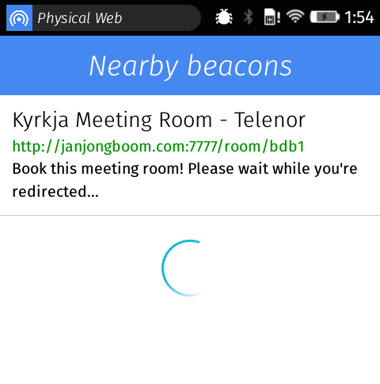

# Firefox OS Physical Web



This is a rudimentary physical web application for Firefox OS. Recognises URIBeacon and Eddystone beacons.

It sorts beacons based on distance, which can be frustrating when 2 beacons are close, as they might jump locations.
You can disable this behavior, and do oldest first ordering by commenting out the following line in scanner.js:

```javascript
.sort((a, b) => calcDistance(a) - calcDistance(b))
```

## Running tests

Tests run via [mocha](https://mochajs.org/). Node.js is not required for running the application.

1. Run `npm install` to install dependencies
2. Run `npm test` to run tests once
3. Run `npm run watch` to run tests and have a file watcher on it too
